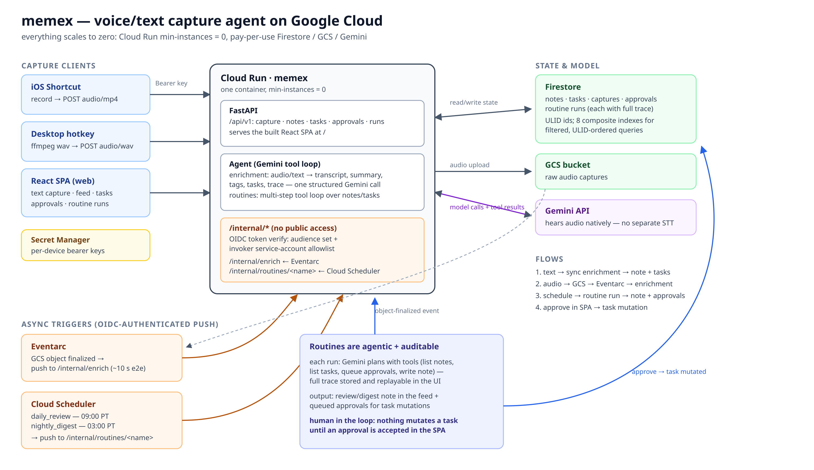

# memex

memex is a personal capture agent.

It runs entirely on Google Cloud and scales down its resource usage when idle.

Speak a thought at your phone, screenshot a page, or dump open tabs. Each
becomes a searchable note with a summary, tags, and any to-dos it contained. A
scheduled agent reviews the backlog and proposes cleanups you accept with one
click, and a chat sidebar lets you ask questions against your data. Initiate
research via
[Gemini Deep Research Agent](https://ai.google.dev/gemini-api/docs/deep-research);
the report is added to the Memex feed.



## The friction

Half-formed thoughts die in the gap between having them and writing them down.
So do the tabs you meant to read, the screenshot you took of a pricing table,
and all the "I should look into that" thoughts.

TL;DR: Minimize friction to capturing ideas/thoughts/notes.

## Capture surfaces

Memex serves an HTTP API and expects a per-device bearer key. There are no user
accounts; the web UI asks for a device key on first use.

| Surface                                                 | What it sends                                        | Endpoint                       |
| ------------------------------------------------------- | ---------------------------------------------------- | ------------------------------ |
| Web (React SPA)                                         | typed text, and the whole read/manage UI             | `POST /api/v1/capture`         |
| [Android app](https://github.com/mjacobs/memex-android) | voice, photo, typed text, shared links and images    | all four capture routes        |
| [iOS app](https://github.com/mjacobs/memex-ios)         | voice, typed text (others coming soon)               | `POST /api/v1/{capture,audio}` |
| [Snippy](https://github.com/mjacobs/snippy) (Chrome)    | an annotated screenshot plus the page it came from   | `POST /api/v1/capture/image`   |
| [Tabby](https://github.com/mjacobs/tabby) (Chrome)      | up to 20 stashed tabs at a time, as read-later notes | `POST /api/v1/capture/links`   |
| iOS Shortcut (Action Button)                            | recorded audio                                       | `POST /api/v1/capture/audio`   |
| Desktop hotkey (`ffmpeg`)                               | recorded audio                                       | `POST /api/v1/capture/audio`   |

Gemini is natively multi-modal; it accepts audio and images (screenshots) as
input; there is no separate speech-to-text or OCR service.

The Android app is a full native client, not a capture stub: feed with tag and
kind filters, task list, approval queue with a pending badge, SSE chat, and the
same agent-trace replay the web UI has. Its device key lives in Keystore-backed
encrypted preferences and is never backed up.

The iOS app supports a subset of this functionality, more coming soon.

## What happens to a capture

**Enrichment.** One structured Gemini call turns a capture into a note:
transcript (or image description), summary, tags, and extracted tasks. The
model's full trace is stored on the note, so you can always see how a note
became what it is.

Text and link captures enrich synchronously and return the finished note. Audio
and image captures return `202` immediately, land in Cloud Storage, and the
object-finalized event drives enrichment through Eventarc — about ten seconds
from speaking to a note in the feed.

**Routines and approvals.** Cloud Scheduler fires two real agent sessions a day:
a task review at 09:00 and a digest at 03:00. Each is a multi-step Gemini tool
loop over your notes and tasks, and each run's complete trace is stored and
replayable in the UI.

Routines cannot touch your tasks. They can only queue an approval — "these five
look like duplicates, drop them?" — that you accept or reject in the web or
Android UI. Only an accepted approval applies the change. That restriction is
enforced by the toolset, not by a prompt: the routine agent has no task-mutation
tool at all.

**Chat.** A sidebar chat runs over the same corpus with a larger toolset. It
streams over Server-Sent Events — one event per model turn, tool call, and tool
result — so you watch the agent work rather than waiting on a spinner. Chat
mutates directly instead of queuing approvals, on the reasoning that your live
instruction in the conversation _is_ the approval. Every mutation still appears
in the stream as a trace event, and the whole conversation is stored.

**Deep Research.** Ask for research on a capture and memex starts a Gemini Deep
Research run on Vertex AI. These take minutes, sometimes tens of minutes — far
longer than a Cloud Run request — so the run is tracked as a durable operation
in Firestore and polled by a self-rescheduling Cloud Tasks job every 30 seconds.
No instance holds the work. When the run completes, the cited report is written
back as a `research` note linked to the one that asked for it. If every instance
dies mid-run, the next poll picks up exactly where it left off.

## Architecture

One Cloud Run container serves everything: a FastAPI API, the agent (Google
ADK + Gemini on Vertex AI), and the built React SPA. Around it:

- **Firestore** — the system of record. Seven collections (captures, notes,
  tasks, approvals, routine runs, operations, chat sessions), ULID-keyed so id
  order is feed order, with composite indexes for the filtered queries.
- **Two GCS buckets** — raw audio (30-day lifecycle) and screenshots, split so
  the two Eventarc triggers and their IAM grants stay separate.
- **Eventarc** — GCS object-finalized events push to `/internal/enrich`.
- **Cloud Scheduler** — two jobs pushing to `/internal/routines/{name}`.
- **Cloud Tasks** — the `memex-operations` queue driving
  `/internal/operations/poll`, re-enqueuing itself while a research run is still
  going.
- **Secret Manager** — the device keys, as one JSON secret.

All of it is Terraform (`terraform/`), including the service accounts and
least-privilege bindings. Cloud Run runs `min-instances = 0`, so an idle
deployment keeps its compute cost low.

There is no background work after a response returns — Cloud Run throttles CPU
between requests, so every unit of work happens inside a request that something
is waiting on. That single constraint is why the long-running research path is a
polled queue and not a thread.

## Security model

The system is single-user, and its threat model is not "another user"; it is
**the content memex ingests**. A screenshot, a saved URL, or a page title is
text somebody else wrote, and it arrives in the same prompt as your own words.

- **Model-read content can never authorize spending.** A deep-research run costs
  real money and hands your note to an agent that browses the open web, so it
  needs an explicit `research` flag set by the client's own affordance — a
  checkbox, a header. It used to trigger on a `research` tag, which meant the
  model could infer one from the text it was reading. That channel is closed.
- **Captured material is data, not instructions.** Every enrichment prompt says
  so, and the structure backs it: each metadata field is flattened to a single
  line so a page title cannot inject a newline and pose as your note, and
  page-supplied fields are ordered before the one field the prompt treats as you
  speaking.
- **A link you save with no note of your own produces no tasks.** Nothing in a
  bare URL and a site-chosen title is you asking for anything.
- **A screenshot _is_ allowed to produce tasks**, because getting a page's
  to-dos back is the point. `docs/contracts.md` records that as an accepted risk
  with its bounds: a task is an inert title, nothing acts on it, and routines
  can only propose changes to it.
- **Internal endpoints are genuinely internal.** `/internal/*` refuses bearer
  keys and instead verifies Google-signed OIDC tokens against an audience plus a
  service-account allowlist, failing closed when configuration is missing.

The open hole, and it is written down rather than papered over: chat can read a
saved page's text through `search_notes` in the same turn that holds
`update_note`. [`docs/chat-tool-policy.md`](docs/chat-tool-policy.md) is the
committed spec for closing it: classify tools by what they can cost, then pause
writes and external calls for confirmation. Its outside-the-code assumptions are
proved by four runnable scripts in `scripts/adk-proofs/` that use a scripted
fake model and cost nothing to re-run.

The first layer is implemented: every chat tool has a tested risk classification
and a resolver that says whether it should run or ask. The confirmation gate,
saved pending state, and UI are not implemented, so chat mutations still run
without that pause. The safe fallback is to remove the mutating tools from
`CHAT_TOOLS` and leave chat read-only.

## Running it locally

Verified from a clean clone on 2026-08-29. The basic test and build path needs
Python 3.13, [uv], Node.js, and [pnpm]. It needs no cloud access or credentials.

```bash
git clone https://github.com/mjacobs/memex.git && cd memex
uv sync                 # installs into .venv
uv run pytest -q
cd web && pnpm install && pnpm test && pnpm build
```

Tests that need a real Firestore are skipped by default; the rest run against an
in-memory fake, so the suite passes with no Google Cloud project. To include the
Firestore integration tests:

```bash
make emulator           # Firestore emulator on :8790, separate terminal
make test               # full suite against the emulator
```

`make test` deliberately fails fast if the emulator is not up — without it the
gRPC client retries forever and says nothing.

To run the app locally you also need Application Default Credentials for a
project with Vertex AI enabled, because enrichment is a real Gemini call:

```bash
make api                # uvicorn on :8780, device key "dev-key"
make web                # Vite dev server, proxies /api to :8780
```

[uv]: https://docs.astral.sh/uv/
[pnpm]: https://pnpm.io/

## Deploying to Google Cloud

Full instructions, including the fresh-project ordering, are in
[terraform/README.md](terraform/README.md). The short version, for a project
with billing enabled and `gcloud` authenticated:

```bash
cd terraform
terraform init
terraform apply -target=google_artifact_registry_repository.docker  # fresh project only
```

Then add a device key, because the container reads the secret at startup and a
revision deployed against a version-less secret will not start:

```bash
echo -n '{"dev": "<long-random-key>"}' \
  | gcloud secrets versions add memex-device-keys --project <project> --data-file=-
```

Then build, apply, and roll out:

```bash
make build                                   # React SPA into memex/static/
gcloud builds submit --project <project> \
  --tag us-central1-docker.pkg.dev/<project>/memex/memex:latest .
cd terraform && terraform apply -var image=us-central1-docker.pkg.dev/<project>/memex/memex:latest
```

Later code rollouts are just `make deploy` — Terraform deliberately ignores the
image after creation, so infrastructure and code roll out independently.

Two things Terraform does not do for you:

- **Raise the Eventarc ack deadline.** The Pub/Sub push subscription Eventarc
  creates defaults to a 10-second ack deadline, which is shorter than an
  enrichment call. Terraform does not own that subscription, so after creating a
  trigger run `gcloud pubsub subscriptions update <sub> --ack-deadline=600`.
  Enrichment is idempotent, so the failure mode without this is wasted retries
  rather than duplicate notes — but it is wasted retries on every single audio
  capture.
- **Hold your device keys.** They never enter Terraform state.

Client setup: [docs/ios-shortcut.md](docs/ios-shortcut.md),
[docs/desktop-capture.md](docs/desktop-capture.md). Snippy and Tabby each take a
service URL and a device key on their options page.

`scripts/smoke.sh` runs the capture path end to end against a deployed instance:

```bash
MEMEX_URL=https://memex-<project#>.us-central1.run.app MEMEX_KEY=<key> scripts/smoke.sh
```

## Documentation

- [docs/contracts.md](docs/contracts.md) — frozen data model, HTTP API, agent
  tool signatures, and the accepted-risk notes
- [docs/agentic-v2.md](docs/agentic-v2.md) — the chat and Deep Research design,
  with the Vertex facts proved against the live API before it was written
- [docs/chat-tool-policy.md](docs/chat-tool-policy.md) — the tool-confirmation
  spec (not yet implemented)
- [PLAN.md](PLAN.md) — the original spec and build schedule

## Influences

All code here is new. Some influences from:

- chat tool policy (`docs/chat-tool-policy.md`) is patterned after
  [obsidian-gemini](https://github.com/allenhutchison/obsidian-gemini)'s
  `src/types/tool-policy.ts` by Allen Hutchison.
- long-horizon-harness pattern from Google ADK samples (Project Horizon)
